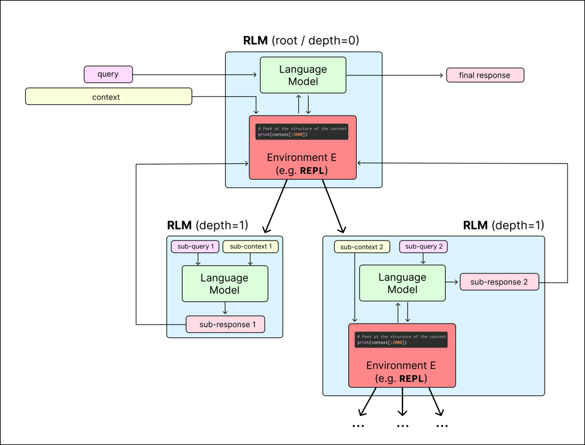

# Integrating Recursive Language Models into CV Warlock

**Author:** [Peter W. Szabo](mailto:peter@kaizen-ux.com)

**Objective:** Enable CV Warlock to handle arbitrarily long CVs and detailed job specs by using **Recursive Language Model (RLM)** techniques. The plan below maps RLM components onto CV Warlock’s architecture and provides a step-by-step implementation strategy focused on production readiness, speed, and accuracy.

## **Mapping RLM Components to CV Warlock’s Architecture**

 *RLM orchestrator concept:* A root language model interacts with an external environment to analyze a long context via recursive sub-calls. We adopt a similar architecture in CV Warlock, allowing the model to process CVs and job specs far beyond a single prompt’s length.

**Roles in RLM and Warlock:** In an RLM, there are three main components – the **root model**, the **environment**, and one or more **sub-models**. We map these directly to CV Warlock’s system:

* **Root LLM (Coordinator):** This will be CV Warlock’s central AI agent (e.g. a GPT-4-level model) that receives the user’s query or task. It does *not* see the full CV or job spec directly. Instead, it orchestrates the solution, deciding which parts of the input to examine and when to invoke helper models. In Warlock’s architecture, the root LLM replaces any single-call LLM usage (e.g. where Warlock may have previously tried to stuff the CV and job description into one prompt). The root acts as a controller, managing the flow of information.  
* **External Environment (Context Store):** We introduce a persistent **REPL environment** (a sandboxed Python interpreter) within Warlock’s backend. This environment holds the entire CV and job specification as variables in memory (e.g. cv\_text and job\_spec) instead of feeding them directly into the prompt. The environment can execute code (e.g. Python commands) emitted by the root model and store intermediate data. In CV Warlock’s terms, think of this as a scratch pad or working memory attached to each request – it contains the full input texts and any notes or partial results the model generates along the way. This component will be a new module in the architecture that runs alongside the root LLM, accessible through a secure interface.  
* **Sub-models (Recursive Calls):** These are additional LLM calls that the root model can invoke on *chunks of the context*. In practice, these sub-calls can use the same underlying model as the root or a smaller/faster model for efficiency. In CV Warlock, a sub-model might be called to analyze one section of a CV or to answer a specific sub-question (e.g. “Does this segment mention skill X?”). The RLM framework treats such calls as function calls: the root model issues a command like answer \= RLM(query\_text, context\_chunk) in the code, which Warlock’s environment executes by spinning up a sub-LLM query on that chunk. The results are returned to the environment for the root to use. All sub-LM calls remain invisible to the end user – externally, Warlock still behaves like a single question-answering system, but under the hood the root model is managing multiple focused LLM calls.

**Integration into Warlock:** Architecturally, we will embed the RLM workflow into Warlock’s back-end service that processes queries. Instead of a single LLM.complete(cv \+ job\_spec \+ question) call, Warlock will use an RLM.complete(question, context=CV+JD) call. The RLM engine (which we can implement using the open-source RLM library or a custom module) handles the loop of model outputs and environment execution. CV Warlock’s existing pipeline (e.g. data ingestion, pre-processing, and final output formatting) can remain mostly unchanged around this core. We will integrate the RLM module where the system previously attempted to deal with long inputs, effectively swapping in the recursive strategy without altering external interfaces. This modular design means if a CV and job spec are within a normal size, we could still fall back to a direct LLM call for speed; but when they are large, the RLM pathway is used automatically. The result is that Warlock’s core now has an **RLM Orchestrator** component managing an internal sandbox and coordinating multiple LLM calls as needed, all while presenting a single coherent result to the user.

 

## **REPL-Style Context Interaction (Symbolic Prompt Handling)**

We will implement a **REPL-style environment** to hold the long contexts symbolically, rather than injecting them into the prompt. This means treating the CV and job spec as external variables that the model can query and manipulate via code. Concretely, when a request comes in:

* **Loading the Context:** The full text of the candidate’s CV and the job description will be loaded into the Python REPL environment as strings (e.g. cv\_text \= "…full CV text…", and job\_text \= "…full job spec text…"). This happens before the root LLM is invoked. Any pre-processing (like stripping formatting or converting PDFs to text) should be done as usual, then the raw texts are assigned to variables in the sandbox.  
* **Isolated Execution:** For production safety, we **isolate this REPL environment**. Instead of using a simple local exec (which could be risky if the model were to output harmful code), we will use a contained sandbox. One option is the RLM library’s Docker-based environment or a cloud sandbox (Modal or similar). A Docker sandbox running a minimal Python image is ideal – it ensures any code (even if malicious or buggy) runs in a throwaway container with no access to the host system or secrets. Warlock’s server will spawn the container, load the variables, execute model-issued code, and then destroy the container once the query is complete. This design provides security and cleanup of memory each time.  
* **Model Instructions for REPL:** The root LLM needs to know it has this tool. We will craft a system prompt for the root model explaining the interface. For example: *“You are an assistant that can analyze a job description (job\_text) and a candidate CV (cv\_text) stored in a Python environment. You can write Python code to inspect these variables. You can call rlm\_query(text\_or\_var, question) to ask a sub-model about a portion of text. When you have the final answer, output it with FINAL(answer).”* This prompt follows the format used in the RLM paper’s example, where the model outputs special markers like FINAL(...) when done. The exact prompting format will use the conventions from the RLM library (e.g. the model might output code in markdown \`\`\`python blocks which the system will execute, and output results that the model sees in its next turn).  
* **Interactive Loop:** Once initiated, the root LLM will begin producing either explanatory text, code snippets, or final answers. The Warlock RLM Orchestrator will capture each output. If it’s a code block, the orchestrator executes it in the sandbox and pipes the stdout/return value (truncated if long) back into the LLM’s input context for the next step. For instance, the model might decide to execute print(len(cv\_text)) or scan for a keyword in job\_text – the result (an integer or found text) will be returned. If the model calls the provided rlm\_query() function (which we will implement to wrap a sub-model call), the orchestrator will invoke the sub-model on the specified chunk and return the sub-model’s answer. This loop continues until the model outputs a FINAL(...) statement, which we capture as the answer.

**Why use REPL-style?** This approach lets the LLM **actively explore** the content rather than passively consuming a giant prompt. It can **inspect, search, and transform** the CV/job data on the fly, using programming logic. For example, it can iterate over sections, filter for relevant keywords, or compute simple statistics (like years of experience) via code. All of this happens *without* overloading the LLM’s context window or relying on it to “remember” long texts. The RLM paper emphasizes that treating the context as a first-class external object, which the model can query as needed, avoids the degradation seen when stuffing too much into the prompt. By implementing the REPL environment, we give CV Warlock a form of **working memory**: the model can write and read intermediate notes, and only pull in the parts of the CV or spec that are needed for the task at hand. This not only enables near-infinite length handling, but also yields interpretable steps (we can log the code and sub-queries to see how the model arrived at an answer, which is useful for debugging and trust).

**Technical Implementation:** We will utilize the open-source RLM framework if possible (as it already supports local, Docker, or remote REPL setups). This saves us from writing the entire orchestration logic from scratch. We would integrate it by initializing an RLM object in Warlock’s code (with appropriate backend model credentials and environment settings) and calling rlm.completion() with our prepared system/user prompt. If using the library, we’ll configure: environment="docker" (for isolation), and define the rlm\_query tool in that environment to call a sub-model (the library may provide this out-of-the-box as something like RLM.call() or by allowing nested rlm.completion calls). Should the library be insufficient for our domain needs, we can implement a simplified custom loop: capturing the model’s code outputs and using Python’s exec in a restricted container manually. In either case, the key is that **the prompt (CV and JD) lives in the environment** and not in the model’s context – the model must explicitly ask for any part of it. This design is central to RLM and we will enforce it in our implementation.

## **Smart Chunking and Filtering for CVs and Job Specs**

Handling resume and job text effectively requires **domain-specific chunking and filtering** so the model focuses only on what’s relevant. The RLM approach allows the model to determine how to chunk the context, but we will guide it with some structure and utilities:

* **Chunk by Document Structure:** We leverage the inherent structure of CVs and job specs. A CV typically has sections like *Education, Work Experience, Skills, Publications,* etc. A job spec often has sections like *Job Overview, Responsibilities, Requirements, About the Company.* We will parse the raw texts into logical sections upfront (this can be done with simple rules or regex in the environment). For example, in the environment we might split cv\_text into a list of sections: cv\_sections \= cv\_text.split("Experience:") (and similarly for other headings). Each section can further be split into individual items, e.g. each job in the Work Experience section becomes its own chunk in a list. We can do the same for the job spec, splitting on bullet points or numbered requirements. These chunks or sections will be stored as variables or easily iterable lists in the REPL environment to facilitate analysis. By providing this initial chunking, we minimize the work the LLM has to do to segment the text. The root model will know, for instance, that it can iterate through cv\_sections rather than treat the CV as one monolith string.  
* **Guided by Job Requirements:** The model (or environment code) will **filter and prioritize** chunks based on the job description’s content. A straightforward strategy is to extract key skill keywords and criteria from the job spec and then search for them in each CV chunk. For example, if the job spec mentions “Project management” and “Python programming,” the environment can do a quick scan: if "Python" in section\_text for each CV section to find where that skill appears. The root LLM could also do this via regex or the provided search tools – e.g., it might issue a code command like re.findall(r'Python', cv\_text) or loop over sections printing those that contain the keywords. We will encourage this approach in the system prompt or provide a utility function (e.g., find\_sections(keyword)) to the environment. This **filtering step** means that large swaths of text that are clearly unrelated to the query can be skipped or summarized only briefly. For instance, a job spec’s company introduction section likely doesn’t require analysis against the CV – the model can ignore it. Likewise, if the CV has an extensive list of publications but the job is a software engineer role that cares more about work experience and skills, the model should focus on the Work Experience and Skills sections, perhaps only summarizing publications if needed for completeness. By chunking the input and then zeroing in on matching segments, we drastically **reduce unnecessary compute** on irrelevant text.  
* **Minimal Necessary Sub-Calls:** The root model will decide where a detailed LLM analysis is warranted. Our strategy is to **only invoke sub-models on chunks that likely contain an answer**. For example, if a job requirement is “5+ years of Java experience” and the CV has a section for a job where the candidate worked 6 years with Java, the root could choose to answer that directly or call a sub-model to double-check the details in that section. On the other hand, for a requirement like “MBA degree preferred,” if the Education section clearly shows no MBA, the root model might not need any sub-call – it can conclude the candidate doesn’t have it without further analysis. We will design the prompt to prefer using code and simple checks first (presence/absence of keywords, numeric comparisons) and escalate to an LLM sub-call only when interpretation is needed (e.g. synthesizing how well the candidate’s described experience with a skill matches the required skill level). This implements the idea of **hierarchical filtering**: cheap operations (string search, counting, etc.) before expensive operations (LLM inference). The RLM paper example highlights that a root LM can use regex to narrow down context, then spawn a recursive call on just that subset. We mirror that pattern in Warlock – e.g., find all paragraphs in the CV mentioning “machine learning”, then ask a sub-LM to summarize each of those paragraphs to see if the experience depth meets the job requirement.  
* **Storing Intermediate Results:** As the RLM runs, we will make heavy use of the environment’s ability to store variables. When a sub-LM returns an analysis of a chunk (for example, *“Candidate has 3 years of experience with Python in this role”*), the root can save that in a variable like result\_python \= "3 years of Python (from CV section 2)". We encourage the model to do this so that it can later compile a final answer incorporating all sub-results. The benefit of this is twofold: (1) **Avoiding duplicate work** – if two job requirements overlap (say one asks for Python, another asks for Java, and a CV section mentions both), the model might call a sub-LM once on that section to extract all skills, store them, and reuse the info for both questions instead of calling twice. (2) **Traceability** – each intermediate answer is explicitly kept, which the model can refer back to or the system can log. The RLM paradigm explicitly allows the final answer to be constructed from stored variables. We will use the FINAL\_VAR(varname) mechanism for the model to output an answer assembled from those stored pieces. For instance, after analyzing each requirement, the model could produce something like: FINAL\_VAR(fit\_summary) where fit\_summary is a string it built in the environment by concatenating assessments for each requirement. This approach ensures the model’s reasoning for each chunk is captured and can be combined cleanly.  
* **Domain-Specific Filtering Logic:** We will bake in a few resume/job-specific heuristics to assist the model. For example, if a job spec has 20 listed requirements, we might preemptively limit the scope to the top 10 that appear most critical (perhaps identified by keywords like “must have” or by the role’s essential skills). Similarly, if a CV has sections like “Hobbies” or “References”, we can mark those as low priority so the model doesn’t waste tokens discussing them. The environment could label sections with tags (e.g., section.priority \= high/medium/low) which the model can use to decide what to focus on first. These little optimizations will help direct the RLM’s attention, preventing it from examining every single part of the input exhaustively when it’s not needed.

By combining these strategies, CV Warlock will implement **“smart chunking”**: breaking the input into meaningfully bounded pieces, and **“smart filtering”**: focusing computation on pieces likely to influence the answer. The RLM’s design means the model inherently will not read anything unless it has to – we reinforce this by providing sensible chunk boundaries and search functions to find relevant text. The outcome is a system that scales to very long inputs by examining them **incrementally and selectively**, rather than blindly summarizing or embedding everything. This both speeds up processing (fewer tokens fed into LLMs overall) and can improve accuracy (since the model can devote its full capacity to the truly pertinent parts of the text, one at a time, instead of diluting attention across a huge prompt).

## **Recursion Depth vs. Speed Trade-offs**

In our RLM integration, **recursion depth** refers to how many layers of sub-model calls the system can make (e.g. the root calling a sub-RLM, which in turn calls another, and so on). We need to balance depth (which can handle more complex or larger inputs) against speed/complexity (each layer adds overhead). For CV Warlock’s use case, we recommend **limiting recursion to depth=1 initially**, meaning the root LLM can call regular LLM subroutines, but those sub-calls cannot themselves spawn further LLM calls. This is consistent with the RLM paper’s own experiments – they found depth=1 sufficient for most long-context tasks and left deeper recursion as future exploration. In practical terms, depth=1 covers our needs: the entire CV and job spec are in the environment, and the root can directly break this into chunks and handle each via sub-models. We don’t anticipate a scenario where a sub-call itself needs to recurse again (which would imply, say, each chunk was still huge or complex enough to require another layer of breakdown – unlikely with reasonably sized sections of a CV or job spec).

**Speed Considerations:** Each recursive sub-call carries a latency and cost (if using an API) similar to an independent LLM query. More depth or more calls can linearly increase total processing time. To keep Warlock responsive, we will optimize to **minimize the number of sub-calls** needed (as discussed in the filtering section). For example, it’s better if the root model combines multiple small questions about one chunk into a single sub-call prompt, rather than calling the sub-model repeatedly for each micro-question. If a CV section is relevant to three job requirements, the root could send one sub-query to summarize how the candidate fares on all three in that section, rather than three separate queries. Achieving this may require careful prompt engineering for the sub-model (asking it to output a structured analysis covering multiple points). We will test and refine the prompt patterns to batch questions when possible.

Another speed trade-off is **model size vs. number of calls**. Using a larger, slower model (like GPT-4) for all sub-calls might yield very accurate analyses but could be slow if dozens of calls are made. Using a smaller, faster model (like GPT-3.5 or a specialized resume-parser LLM) for sub-calls could significantly speed up each call at the cost of some accuracy or detail. The RLM framework is flexible about model choice per call, so a sensible strategy is: *make the root model high-capability*, since it needs strong reasoning and coding skills, and use a slightly smaller but still competent model for sub-analysis of chunks. We will experiment with this: for instance, let the root be GPT-4 (for reliable planning and coding) and sub-calls use GPT-3.5 (for quick content summary/extraction). If the sub-results are found lacking in quality during testing, we can always switch sub-calls to use GPT-4 as well. However, often sub-tasks like “extract key points from this paragraph” can be handled by a cheaper model correctly, and the root can correct or double-check as needed. This approach was validated by the RLM research – they demonstrated that an RLM using a **smaller model** outperformed a single large model on a long context task, with much lower total token usage. In other words, recursion can amplify the effectiveness of a less powerful model by giving it manageable chunks, so we should exploit that for better speed/cost.

**Parallelism:** Currently, the RLM loop is sequential – the root decides one action at a time, often waiting for each sub-call result before proceeding. This is inherently slower than reading everything at once, but far more accurate for long texts. In a production scenario, if we identify independent sub-tasks, we could parallelize some of them (for example, analyzing the CV’s education vs. work experience could in theory happen concurrently). However, implementing parallelism is non-trivial because it means stepping outside the model’s own control flow. Initially, we will stick to the straightforward sequential recursion (which keeps the logic self-contained and easier to audit). If performance profiling shows bottlenecks, one idea is to have Warlock’s orchestrator proactively spawn certain sub-queries in parallel (based on a plan the root model outlines), and then feed all results back to the root for a final synthesis call. This would be a custom optimization – it sacrifices some of the model’s autonomous decision-making for speed. We will consider this only if needed, and it will come with careful management to ensure the model still gets all the data it needs in a coherent way.

**Recursion Limits and Timeouts:** To ensure speed and cost remain bounded, we’ll implement safety limits. The system will cap the number of recursive calls allowed per query (e.g. maximum of 20 sub-LLM calls) and possibly the total tokens consumed. If the model hasn’t produced a FINAL answer by then, the orchestrator will stop and return a partial answer or an error message. We’ll also set a wall-clock timeout for the whole process. These measures guarantee that even in worst-case scenarios (or if the model gets confused/loops), Warlock’s response time won’t explode. In practice, we expect far fewer calls will be needed (maybe 5–10 subcalls for a very large CV+JD). Depth=1 with these controls provides a predictable performance profile.

In summary, **depth=1** recursion with judicious sub-call usage gives us the best balance of thoroughness and speed for CV Warlock. We avoid the complexity of deeper recursive loops (which could exponentially slow things down), and instead focus on making each *breadth* of recursion (the set of chunks) as efficient as possible. This approach will be iteratively tested – if we find the model is making too many calls or going step-by-step when it could combine steps, we’ll refine the prompts to encourage more efficient planning. Conversely, if accuracy is suffering, we might allow it to take more steps or use larger models for subcalls as needed. Our implementation will log timing for each call, so we can identify slow points and optimize them.

## **Model Capability Requirements and Considerations**

To successfully deploy an RLM-powered CV Warlock, the underlying language model(s) must meet certain capability criteria:

* **Strong Code Understanding:** The root LLM needs to reliably read and write Python code. The entire RLM approach hinges on the model executing code to manipulate the context. That includes using Python standard libraries (e.g. regex, string operations) and our provided helper functions (rlm\_query, etc.). In production, we can’t afford the model to make frequent syntax errors or logic mistakes in code – it should be at least as good as a junior developer in writing simple scripts. Models like GPT-4 (especially the code-tuned variant) or Google’s Codey/PaLM with code skills are good candidates. We will run the root model at a fairly low temperature (e.g. 0 or 0.2) to maximize deterministic, logical outputs. The sub models also should be able to understand instructions and return structured answers (though they may not need to produce code themselves). During development, we’ll test the model on basic coding tasks (like splitting a text by headers, searching for a keyword) to verify its competency. If we find limitations (e.g. the model struggles with Python off-by-one errors or unfamiliar libraries), we will adjust by providing **utility functions** in the environment – essentially pre-coding some of the needed logic so the model can call a function rather than write it from scratch. For instance, we might implement get\_years\_experience(cv\_section) in the environment to calculate how many years a person worked in that section, so the model just calls that instead of coding a date diff itself. This makes the system more deterministic and safe.  
* **Logical Reasoning and Comprehension:** Beyond coding, the model must understand resumes and job requirements well. It should be proficient in extracting facts (like education level, years of experience in X) and making inferences (like “experience with Python” might be evidenced by various terms – the model should connect tool names, frameworks to the skill). Large general models have this knowledge from pretraining. If needed, we can few-shot the model with examples of CV-to-job matching to boost its reliability in this domain. For example, include a short demonstration in the system prompt of how to analyze one requirement against a sample CV snippet. This can guide the model’s outputs to be more structured and on-point.  
* **Determinism and Consistency:** In a hiring or screening context, consistent outputs are important (so that candidates are evaluated uniformly). Using an RLM reduces context-related randomness (the model always explicitly looks things up rather than depending on what was in its immediate context). We will further enforce consistency by using fixed prompts and a deterministic decoding setting. The chain-of-thought (the sequence of code and subcalls) for a given input should ideally be reproducible. We’ll log the decisions the model makes; if we spot nondeterministic behavior (like sometimes it chooses to analyze a section, other times it skips it without reason), we may adjust the prompt to standardize the approach (for example, instruct it to always check each requirement methodically). The RLM’s “librarian” style reasoning naturally encourages the model to gather notes and evidence before concluding, which tends to yield more grounded and less capricious answers. We will lean into that by asking the model to present its findings (perhaps internally) before finalizing. In production, we might not show all intermediate steps to users, but having them in the logs means we can audit decisions if needed (important for an explainable AI in hiring).  
* **Model Size and Deployment:** Running many calls with a very large model could be costly. If using an external API (OpenAI, etc.), we’ll monitor token usage. It might be feasible to run the entire pipeline on a local model if we choose a strong one (for example, a fine-tuned LLaMA 70B that has some coding capability). This would eliminate API latency and cost, at the expense of needing GPU infrastructure. As a prototype, we’ll start with API models for convenience (e.g. GPT-4 for root, GPT-3.5 for subs) and measure performance. If the approach proves valuable, we can explore hosting our own model to reduce recurring costs. The model should ideally support at least a 4k-8k token context (for safety when handling sections and intermediate content). Each subcall might need to see a chunk of maybe 1k tokens plus some prompt overhead. Most modern models satisfy this, but it’s a factor in model selection.  
* **Potential Training/Fine-tuning:** While our initial implementation uses pre-trained models with clever prompting, longer-term we should consider fine-tuning or training a model specifically for the recursive approach. The RLM paper suggests that models explicitly trained for recursive reasoning would perform even better. In production, if we gather enough examples of Warlock handling CVs and job specs, we could fine-tune a model to follow the desired chain-of-thought (making it more reliable and faster at it). For now, this is optional – the plan is to get a working system with existing models – but it’s a future path to keep in mind as we evaluate results.

In summary, the chosen models must be **“agentic”** enough to treat the context as something to investigate step by step, rather than a blob to ingest. They require solid coding chops, reading comprehension, and a controlled reasoning style. We will validate these qualities in a staging environment with diverse CVs and job postings. If any capability gap is identified (e.g. model consistently misinterprets a certain CV format or fails to use a tool), we will either switch to a more capable model or compensate with prompt and tool engineering.

## **Prototype Architecture and Implementation Steps**

Finally, we outline a clear implementation plan for a **minimal working prototype** of RLM-powered CV Warlock. This prototype will demonstrate the end-to-end functionality on a small scale before we harden and optimize it for production:

1. **Set Up RLM Framework:** Integrate the RLM library into the CV Warlock codebase. This involves adding it as a dependency (e.g. via pip). If using the rlm open-source repo, we follow its installation and ensure we can instantiate an RLM object with our OpenAI API key or chosen model backend. We will start with the local (non-isolated) environment for initial testing (to simplify debugging) and then switch to the Docker isolated environment for production. As a quick sanity check, run a trivial RLM query (like asking it to print the first 10 words of a long dummy text) to confirm the REPL and sub-call mechanism works in our setup.  
2. **Implement Warlock Orchestrator Module:** Create a module (e.g. warlock\_rlm.py) that interfaces between Warlock’s existing API and the RLM. This module will expose a function analyze(cv\_text, job\_text, user\_query) \-\> answer. Inside this function:  
   3\.      Launch the REPL environment (if using Docker, spin up the container here).  
   4\.      Load the cv\_text and job\_text into the environment’s memory.  
   5\.      Formulate the system prompt and user prompt for the root model. The system prompt will contain instructions as described (available tools, variables, goal), and the user prompt is essentially the task request (e.g. *“Assess the candidate’s fit for the job”* or whatever query is relevant).  
   6\.      Call rlm.completion(prompt, environment=…, model=…) and wait for the final result.  
   7\.      Capture the FINAL output as answer. Also log the trajectory (all code and subcalls) for debugging.  
8. Return the answer to the rest of Warlock’s system (which will format it for display or further use).  
9. **Design the Prompt Template:** Craft the content of the system prompt carefully. We’ll include a brief description of the CV and job spec variables, and explicitly list what the model should output. For the prototype, we might focus on a single broad task (e.g. “Compare this CV to the job requirements and explain the match/mismatch”). In production, Warlock might support multiple query types (e.g. “Just extract skills” vs “Give a hiring recommendation”). Each may need a slightly different prompt. For now, we’ll implement one representative scenario to validate the approach. The prompt will also include an example of using code and subcalls (few-shot demonstration) if we find the model needs that to get started. We’ll iterate on this prompt by testing on a few known CV+JD pairs and checking if the outputs make sense and the model is indeed using the tools as expected.  
10. **Utility Functions in Environment:** In the prototype, implement a minimal set of helper functions directly in the sandbox before the model runs. For example, we add:  
    11\.  def rlm\_query(text, question): which calls the chosen sub-model (say GPT-3.5) with the given text as context and the question, then returns the answer string. This hides the API details from the model – the model just calls rlm\_query like a function.  
    12\.  Perhaps a simple def find\_keyword(keyword, text): to return indices or snippets where a keyword appears (to help the model, though it could use Python’s own methods too).  
13. Any domain-specific parser like def split\_sections(cv\_text): that returns a dict of sections. The model can call this instead of writing the splitting logic. These functions will make the model’s job easier and results more consistent. In our tests, we’ll observe if the model uses them. If not, we may explicitly remind it in the prompt that it can.  
14. **Test with Sample Data:** Run the prototype on a couple of long CVs and job descriptions (the longer the better to truly test the context handling). Observe the logs:  
    15\.  Verify that the model is **not pulling the entire text** into a single prompt. We should see it executing code to slice or search through the text (a good sign).  
    16\.  Check that it uses recursive calls for relevant chunks. For instance, when a job requirement is encountered, does it call rlm\_query on the corresponding CV section? The logs might show something like: model code: result \= rlm\_query(cv\_section\_3, "Does this section show leadership experience?").  
17. Ensure the final answer is sensible and addresses the user query, using info from the CV and JD. We expect some trial-and-error here – maybe the model misses a section or misinterprets something initially. We will refine prompts or add more tools until the process is robust.  
18. **Optimize and Harden:** With a working prototype, we then focus on production readiness:  
    19\.  **Switch to Isolated Environment:** Configure the orchestrator to use the Docker REPL for real deployments. Test again to ensure everything works in that mode (there might be slight differences like needing to preload our helper functions in the container).  
    20\.  **Performance Tuning:** Measure the average time per analysis. If too slow, revisit chunking logic or consider parallel subcalls as discussed. Also try reducing token usage by trimming prompts or using more efficient models.  
    21\.  **Error Handling:** Add safeguards: if the model attempts to execute disallowed operations (file access, network calls), the environment should prevent it. We can use a restricted Python execution environment for this. Also handle cases where the model output doesn’t follow protocol (e.g. never returns FINAL). We might implement a fallback to break out of the loop after a certain number of steps and have the orchestrator attempt to summarize whatever information was gathered so far into an answer.  
22. **Scaling Considerations:** If Warlock will handle multiple requests concurrently, ensure that each request gets its own isolated environment and model instances. The orchestrator module should be stateless between requests. We will also implement a queue or limit so that we don’t spawn too many parallel Docker containers or API calls under high load (to avoid exhausting resources).  
23. **Monitoring and Logging:** Finally, incorporate monitoring. Every RLM session will produce a log of actions (we can use the RLM library’s logging feature). These logs will be invaluable to track what the model is doing and to later explain decisions to users or developers. We’ll pipe important metrics (like number of subcalls, total tokens, processing time) to our monitoring dashboard to watch in production. This will help in iteratively improving the system post-deployment (for example, if we notice it’s always making 15 subcalls, maybe we can prompt it to be more efficient).

With this implementation plan, **CV Warlock’s architecture** gains a powerful RLM-based “brain” that actively navigates long inputs. We map each of the RLM’s novel components to a concrete piece in the system, use domain knowledge to guide chunking of resumes, and keep the solution production-focused (secure sandboxing, timeouts, logging). The end result will be a prototype that can, for example, take a 50-page CV and a 5-page job spec and produce a targeted analysis, all while using a standard LLM that normally could never ingest that much text at once. This plan prioritizes architectural clarity and practical steps so we can move from concept to a working system. By following these steps and gradually refining, we will achieve a CV Warlock that scales to very long documents with both **speed and accuracy**, demonstrating the real-world value of Recursive Language Models in an AI application.

 

**Sources:**

1\.      Zhang et al., *Recursive Language Models*, arXiv preprint 2512.24601 (Dec 2025\) – RLM introduction and code, [https://arxiv.org/pdf/2512.24601](https://arxiv.org/pdf/2512.24601)

2\.      Zhang’s RLM Blog Post (2025) – Explanation of treating prompt as a variable and recursive sub-calls, [https://alexzhang13.github.io/blog/2025/rlm/](https://alexzhang13.github.io/blog/2025/rlm/)

3\.      Jain, *RLMs from first principles* (Medium, Jan 2026\) – Simplified overview of RLM roles and benefits

4\.      RLM GitHub Documentation – Details on REPL sandbox options and usage, [https://github.com/alexzhang13/rlm](https://github.com/alexzhang13/rlm)  

5\.      Wissem Hammoudi, *LLM Resume Screening* (2024) – Traditional approach using retrieval (contrast to our RLM strategy), [https://towardsdev.com/resume-screening-application-6e9674226e98](https://towardsdev.com/resume-screening-application-6e9674226e98)